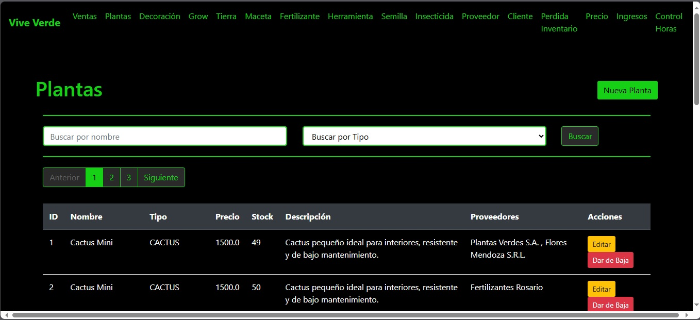
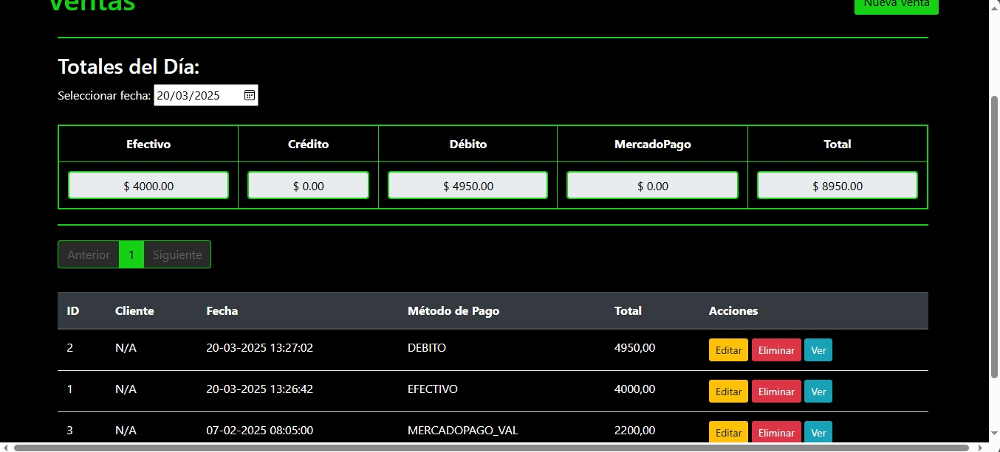
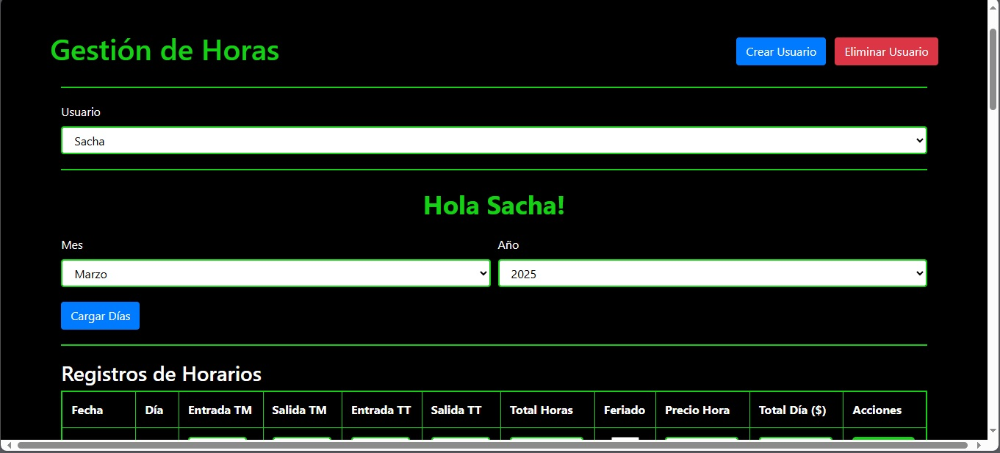
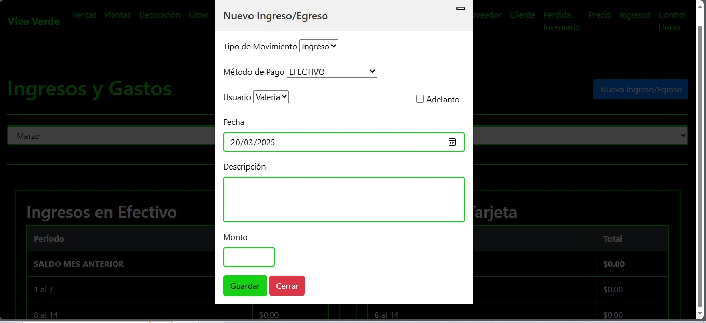
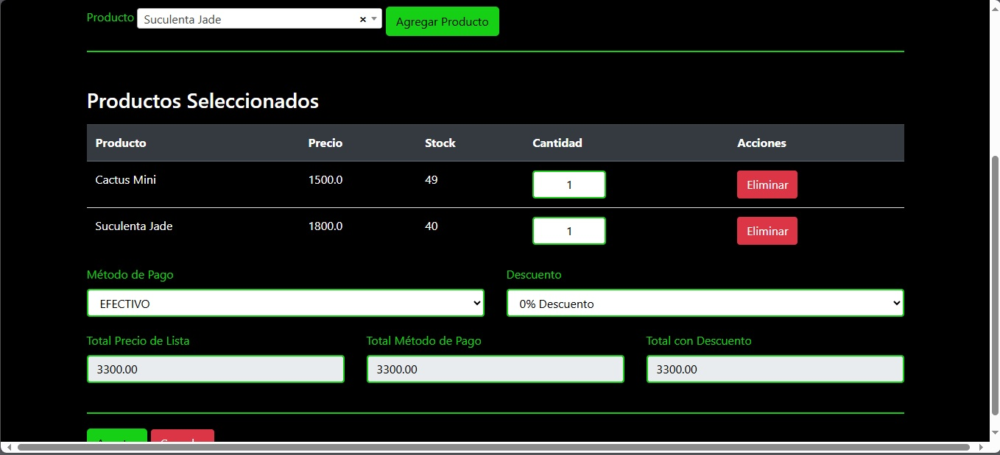

# 🌱 Sistema de Ventas y Stock - Vivero

Este es un sistema de ventas y control de stock diseñado para el vivero. Permite gestionar productos, clientes, proveedores, ventas, ingresos y horarios de empleados.

🌍 Acceso a la Aplicación

🔗 URL: https://viveroviveverde.site

📌 **Idioma:** Español

## 🚀 Tecnologías Utilizadas

- **Backend:** Java 17, Spring Boot (JPA, Hibernate, Spring Security)
- **Base de datos:** SQLite
- **Frontend:** Thymeleaf
- **Servidor y despliegue:** Nginx, Systemd
- **Control de versiones:** Git
- **Automatización:** Scripts de backup y reinicio automático

## 📌 Funcionalidades

✅ Gestión de productos (Plantas, Macetas, Herramientas, Decoraciones, etc.)  
✅ Control de stock e ingresos  
✅ Registro de clientes y proveedores  
✅ Módulo de ventas con diferentes roles de usuario  
✅ Seguridad con Spring Security (CSRF y BCrypt)  
✅ Registro de horarios de empleados  
✅ Manejo de logs y reinicio automático en caso de fallo  

## 🔑 Roles y Permisos

- **Admin**: Acceso completo a todas las funciones
- **Ventas**: Solo puede ver productos, clientes, proveedores y gestionar ventas

## ⚙️ Instalación y Ejecución

1. Clonar el repositorio:
   ```sh
   git clone https://github.com/PabloBarberis/viverolite.git
   cd viverolite
   ```
2. Configurar el archivo `.env` con las variables necesarias
3. Compilar y ejecutar la aplicación:
   ```sh
   mvn clean install
   java -jar target/viverolite-0.0.1-SNAPSHOT.jar
   ```

## 📸 Capturas de Pantalla







## 📞 Contacto

Desarrollado por **Pablo Barberis**  
LinkedIn: [https://www.linkedin.com/in/pablo-barberis-380378280/](https://www.linkedin.com/in/pablo-barberis-380378280/)  
Email: [pablobarberis@live.com](mailto:pablobarberis@live.com)

---

## 🌍 English Version

# 🌱 Sales and Stock Management System - Nursery

This is a sales and stock management system designed for a nursery. It allows managing products, customers, suppliers, sales, income, and employee schedules.

🌍 Application Access

🔗 URL: https://viveroviveverde.site

📸 Screenshots

📌 **Language:** Spanish

## 🚀 Technologies Used

- **Backend:** Java 17, Spring Boot (JPA, Hibernate, Spring Security)
- **Database:** SQLite
- **Frontend:** Thymeleaf
- **Server & Deployment:** Nginx, Systemd
- **Version Control:** Git
- **Automation:** Backup and auto-restart scripts

## 📌 Features

✅ Product management (Plants, Pots, Tools, Decorations, etc.)  
✅ Stock and income control  
✅ Customer and supplier registration  
✅ Sales module with different user roles  
✅ Security with Spring Security (CSRF and BCrypt)  
✅ Employee schedule tracking  
✅ Log management and automatic restart on failure  

## 🔑 Roles & Permissions

- **Admin**: Full access to all functionalities
- **Sales**: Can only view products, customers, suppliers, and manage sales

## ⚙️ Installation & Execution

1. Clone the repository:
   ```sh
   git clone https://github.com/PabloBarberis/viverolite.git
   cd viverolite
   ```
2. Configure the `.env` file with the necessary variables
3. Compile and run the application:
   ```sh
   mvn clean install
   java -jar target/viverolite-0.0.1-SNAPSHOT.jar
   ```

## 📸 Screenshots


## 📞 Contact

Developed by **Pablo Barberis**  
LinkedIn: [https://www.linkedin.com/in/pablo-barberis-380378280/](https://www.linkedin.com/in/pablo-barberis-380378280/)  
Email: [pablobarberis@live.com](mailto:pablobarberis@live.com)

